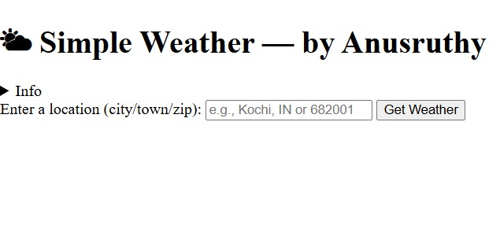
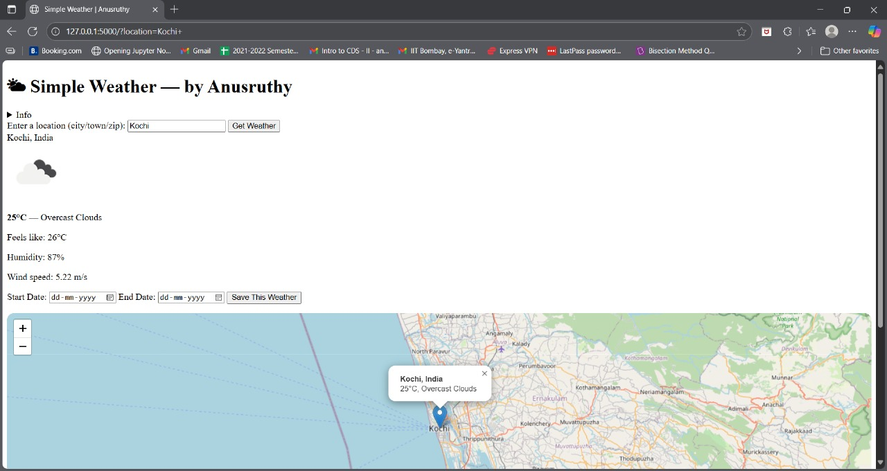
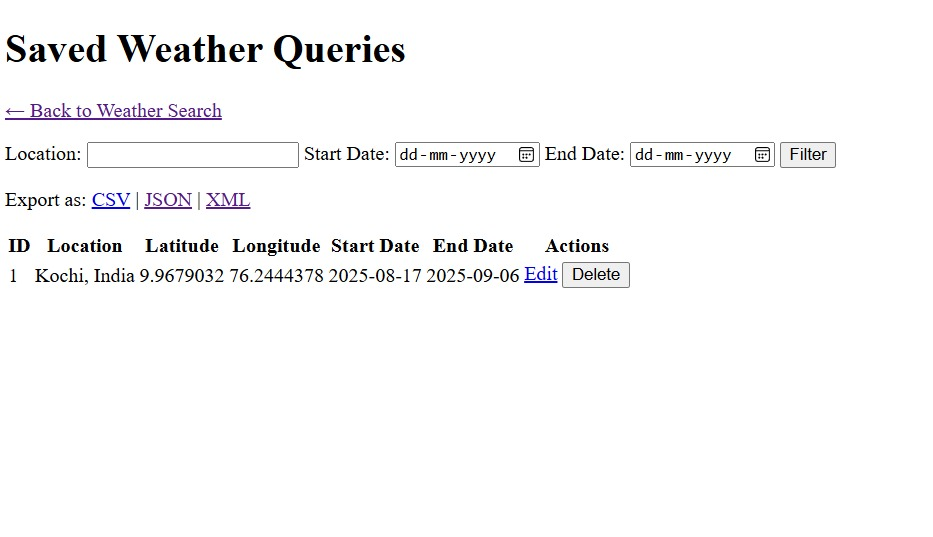

# 🌤 Simple Weather App  

A full-stack Flask-based weather application that fetches real-time weather data using OpenWeatherMap API, supports CRUD operations for saving queries, and allows exporting results in CSV, JSON, and XML formats.
The app can be run locally or via Docker for portability.
This app allows users to:  
- Search and view current weather data 
- Check 5-day forecast 
- Save queries with date ranges  
- View saved searches in a table format   
- Export saved weather queries to **CSV**, **JSON**, or **XML**   
- View searched location on an **interactive map (Leaflet + OpenStreetMap)**   

---

## 🚀 Features  
- Search weather by city, town, or ZIP code  
- Display **current weather** with temperature, humidity, wind speed  
- **5-day forecast** in a horizontal card layout  
- Save weather queries (with start & end date)  
- View all saved queries in a table with **Edit/Delete** options  
- Export saved queries to CSV, JSON, XML  
- Integrated with **Google Maps/Leaflet** for location preview  
- User-friendly interface with modern UI (CSS styling)  
- Fully containerized with **Docker**  

---

## 🛠️ Tech Stack  

### Backend  
- **Python 3.10**  
- **Flask** (Web Framework)  
- **SQLite** (Database)  
- **SQLAlchemy** (ORM)  
- **Requests** (API calls)  
- **dicttoxml** (XML export)  

### Frontend  
- **HTML5, CSS3 (custom styles in `static/static.css`)**  
- **Jinja2** (templating)  
- **Leaflet.js** (interactive maps)  

### Deployment & Containerization  
- **Docker** 

---

## ⚙️ Installation & Setup  

### 🔹 Run Locally  
1. Clone the repository  
   ```bash
   git clone https://github.com/Anusruthy/Weather-App.git
   cd Weather-App
   ```

2. Create a virtual environment
   ```bash
   python -m venv .venv
   ```

3. Activate the environment
- Linux/Mac:
   ```bash
   source .venv/bin/activate
   ```
- Windows:
  ```bash
  .venv\Scripts\activate
  ```

4. Install dependencies
   ```bash
   pip install -r requirements.txt
   ```

5. Add API Key
   - Create a .env file in the root directory
   - Add your OpenWeatherMap API key:
       OWM_API_KEY=your_api_key_here

6. Run the app
   ```bash
   python app.py
   ```

### 🐳 Run with Docker
1. Build the Docker image
   ```bash
   docker build -t weather-app .
   ```

2. Run the container
   ```bash
   docker run -p 5000:5000 weather-app
   ```
- Then open the localhost server in both.
  👉 http://127.0.0.1:5000
- Running the app using Docker container is the easiest way.


### 📤 Export Functionality
- CSV → Downloads weather_queries.csv
- JSON → Returns structured JSON
- XML → Returns XML using dicttoxml


### 🗂️ CRUD Operations
- Create → Save a weather search with date range.
- Read → View saved weather queries.
- Update → Edit saved query details.
- Delete → Remove unwanted saved queries.


### 🔑 API Integration
- OpenWeatherMap API → Weather & 5-day forecast.
- Geopy/Nominatim API → Location lookup (with fallback to OWM).
- Leaflet.js → Map display for searched location.


### 📊 Features Demo
- Enter city/zip → get current weather & forecast
- Save weather queries → manage later (edit/delete)
- Export results → CSV, JSON, XML
- Interactive map → displays searched location


## 📸 Screenshots  

### Weather app
  

## Forecasting example 


##Saved Queries



## 📈 Future Improvements  
- Add user authentication (login & personalized saved queries)  
- Deploy on cloud (Heroku, AWS, or Render) for public access  
- Add charts/graphs for weather trends  
- Improve error handling with custom messages  
- Dark mode UI support  


## Acknowledgements  
- [OpenWeatherMap](https://openweathermap.org/) for weather data  
- [Leaflet.js](https://leafletjs.com/) + [OpenStreetMap](https://www.openstreetmap.org/) for maps  
- [dicttoxml](https://github.com/quandyfactory/dicttoxml) for XML export  


## 📜 Project Note  
This project was developed as part of a **company assessment task**.  
All company-related details included in the app are for **educational/demo purposes only**.  

Developed by **Anusruthy R** ✨  


